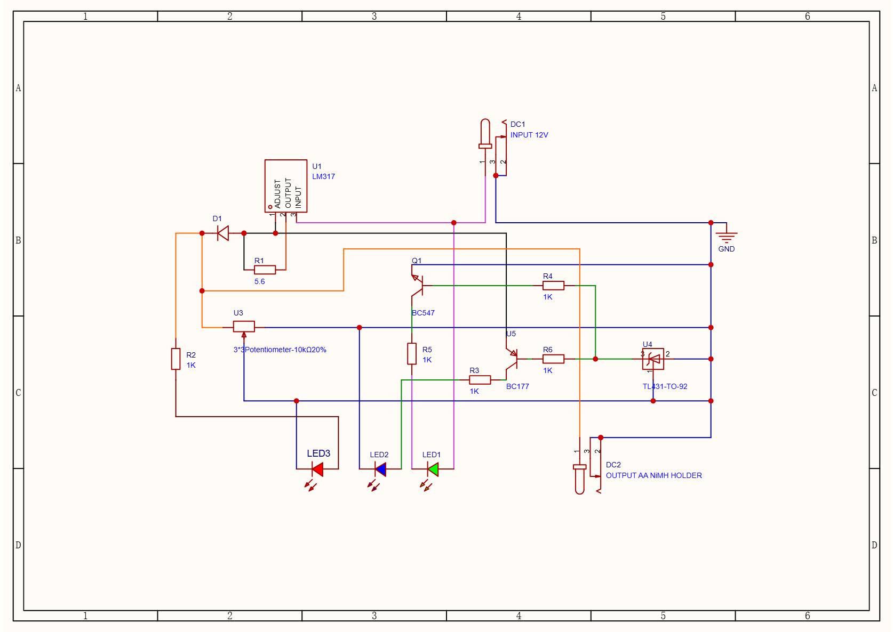

# Smart AA Battery Charger with Automatic Cut-Off 🔋

A reliable, fully analog smart battery charger for rechargeable AA Ni-MH batteries. This circuit uses constant-current regulation and precision voltage sensing to automatically stop charging when the batteries are full, protecting them from overheating and extending their lifespan.

## 🌟 Project Features
* **Safe Constant Charging:** Delivers a steady, safe current (~223mA) to prevent thermal damage.
* **Automatic Cut-off:** Instantly stops charging the moment the peak voltage threshold is reached.
* **Exclusive LED Logic:** Uses three distinct lights to show the exact system status:
  * 🔴 **Red LED Only:** System ON, but no battery inserted.
  * 🔴 + 🟡 **Red & Yellow LEDs:** Battery is currently charging.
  * 🔴 + 🟢 **Red & Green LEDs:** Battery is 100% full.

## 🛠️ Components Used

| Component | Description | Qty |
| :--- | :--- | :---: |
| **LM317** | Adjustable voltage regulator (Configured for constant current) | 1 |
| **TL431** | Precision programmable shunt regulator (Acts as the voltage sensor) | 1 |
| **BC547** | NPN Transistor (Switches the Green LED ON) | 1 |
| **BC177** | PNP Transistor (Switches the Yellow LED OFF) | 1 |
| **1N4007** | Rectifier diode (Blocks reverse current drain) | 1 |
| **5.6Ω Resistor** | 1W power resistor (Sets the 223mA current) | 1 |
| **1kΩ Resistors**| 1/4W standard resistors (Protects LEDs and transistor bases) | 4 |
| **10kΩ Preset** | Trimming potentiometer (Used to calibrate the cut-off voltage) | 1 |
| **LEDs** | 5mm standard indicators (Red, Yellow, Green) | 3 |
| **Hardware** | 4-Slot AA battery holder & standard Veroboard | 1 |

## 📊 Circuit Diagram

## ⚙️ How It Works

1. **Current Control:** The LM317 IC and the 5.6Ω resistor work together to create a steady output current of ~223mA. The 1N4007 diode acts as a one-way valve to ensure power flows safely into the battery.
2. **Voltage Sensing:** The 10k Preset continuously samples the battery's terminal voltage and feeds it into the TL431 IC. 
3. **Smart Switching:** * **While Charging:** The TL431 stays OFF. The BC177 transistor remains ON, lighting up the Yellow LED.
   * **When Full:** The battery reaches the calibrated threshold limit. The TL431 triggers ON, dropping its output to Ground. This instantly turns the BC177 OFF (Yellow LED turns off) and biases the BC547 ON (Green LED lights up).

## 🔧 Setup and Calibration
1. Assemble the components on a stripboard according to the schematic.
2. Power the circuit with a 12V DC adapter (do not insert batteries yet). Only the Red LED should turn ON.
3. Connect a multimeter to the battery holder terminals.
4. Slowly adjust the **10k Preset** until the Green LED turns ON at exactly **5.7V** (for a 4-slot configuration).
5. Insert drained batteries; the Green LED will extinguish, and the Yellow LED will illuminate to indicate active charging.
